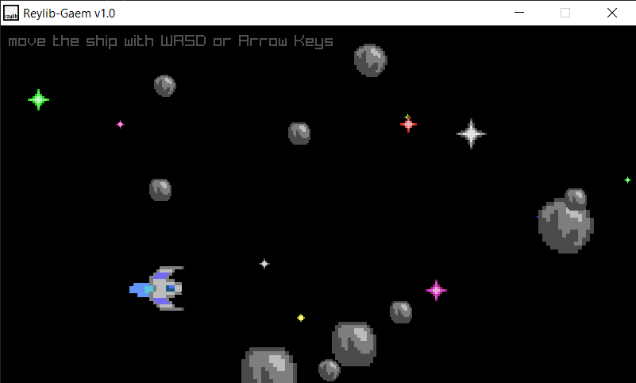

# RaylibTest
My first game with [Raylib](https://www.raylib.com/) C++ game library.\

\
This project was made with [VSCode](https://code.visualstudio.com/) (with [C/C++ Extension](https://code.visualstudio.com/docs/languages/cpp) installed).\
Press <kbd>F5</kbd> to build & run the program (Debug: Build Debug, Run: Build Release).\
`Ctrl + Shift + P (Command Pallete) > Task` to run tasks (Build Debug/Relase and Run main.exe).\
\
Game Art: https://opengameart.org/content/1616-ship-collection
